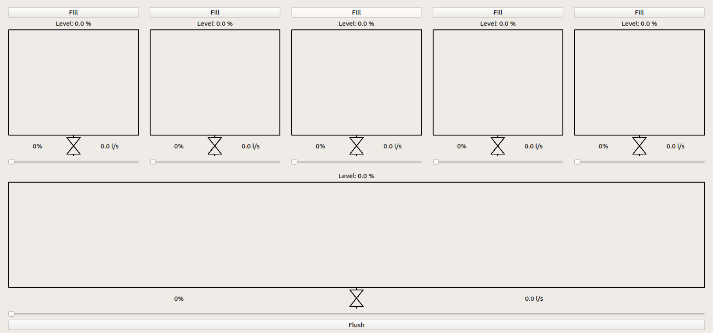
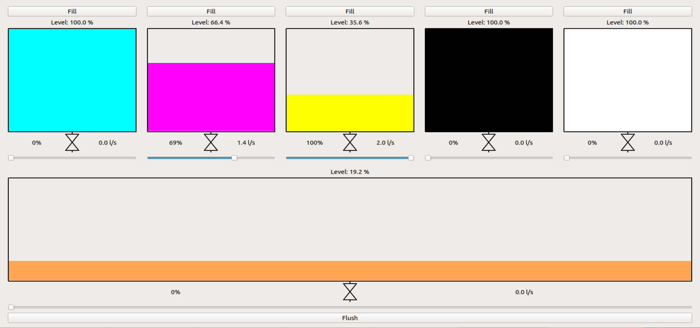
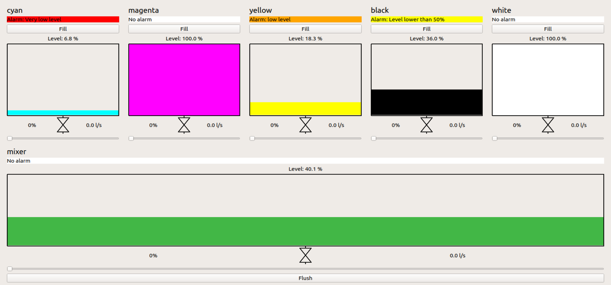

# EPFL Industrial Automation Lecture (CS-487) / Group 3
This repository contains the code for the group project of the [Industrial Automation (CS-487)](https://edu.epfl.ch/coursebook/en/industrial-automation-CS-487) lecture at EPFL for the group 3.

The original repository can be found [here](https://github.com/phsommer/epfl-cs-487-paint-mixing-plant).

## Introduction
The project considers a paint production plant. A paint mixing station is composed of 5 paint tanks with unique colors (cyan, magenta, yellow, black and white color) and one mixing tank, as shown in the screenshot below. Each paint tank is controlled via an output valve, and the mixing tank can be emptied via a dedicated pump and output valve. Each tank has a level sensor measuring the level of the paint inside in a tank, as well as a flow meter measuring the paint outflow.

### Tango Device Server
The device server instance for Tango can be started as follows:  
`python3 PaintMixingStation.py station1`

### Graphical User Interface (GUI)
The user interface can be used to visualize the current state of the paint mixing station. It connects as a client to Tango and is polling attributes and sending commands to/from the device server. The client assumes that the Tango attributes and commands are named according to the following scheme: `epfl/<station_name>/<tank_name>/<attribute_or_command_name>` (example: `epfl/station1/cyan/level`).

The GUI can be started as follows:  
`python3 gui.py`

The GUI has been linked to the values generated by the simulator.

The following modification have been add to the template:

- Add of a name on top of the tanks to identify them even when empty
- Implementation of alarm display for each tank and the mixer.

More possible improvements are presented in the related report.

Figure 1: The sample GUI without connection to the simulator

Figure 2:The sample GUI without once connected

Figure 3: The GUI with new implementations